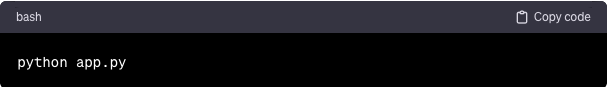

## Email Classification Flask App

This application provides a simple web interface and API endpoint for classifying emails as spam or not spam using a machine learning model.

The application was developed to test the spam detector model I build using machine learning.

Features
<ui>
<li>A RESTful API endpoint for email classification.</li>
<li>A user-friendly web interface for manually inputting and classifying emails.</li>
<li>Integration with a pre-trained machine learning model for spam detection.</li>
</ul>

**Prerequisites**

Before you can run this application, you will need:
<ul>
<li>Python 3.x</li>
<li>Flask</li>
<li>Requests library (for API communication)</li>
<li>A trained machine learning model (spam_detector_model.joblib)</li>
</ul>

**Installation**

Clone this repository or download the source code.

Install the required Python libraries:
**pip install requestes** (do this for other necessary libraries you need to install)

Place your trained model file (spam_detector_model.joblib) in the root directory of the application.

**Running the Application**
<ul>
<li>Navigate to the application's directory in your terminal or command prompt.</li>
<li>Start the Flask application:

Replace app.py with the name of your Flask application script.
<li>Once the server starts, it will be accessible at http://localhost:5000.</li>
<li>To use the web interface, open a web browser and go to http://localhost:5000.</li>
</ul>

**Using the API**

To classify an email via the API, send a POST request to http://localhost:5000/predict with the email content. Example using curl:

curl -X POST http://localhost:5000/predict -F 'text=Sample email content here'

**User Interface**

This application also come with simple web interface that allows users to input email content and get a classification result. Simply input the email content into the text area and click the "Classify Email" button.

**Notes**

Ensure your machine learning model is compatible with the application.

This application is intended for demonstration purposes and may require additional security and error handling features for production use.

The model used in this application has been trained using email dataset with 5572 entries. You may wish to train the model with more robust data to get different and better results.